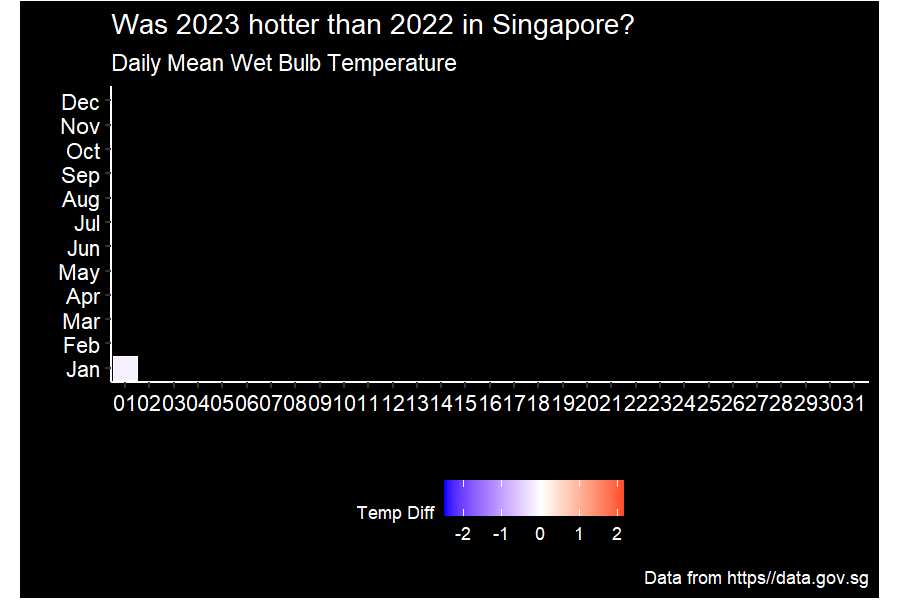

```{css, echo = FALSE}
h1 {
  display: none;
  margin:0;
}
description {
  visibility: hidden;
  margin:0;
}
date {
  visibility: hidden;
  margin:0;
}

```

<!-- Google tag (gtag.js) -->

```{=html}
<script async src="https://www.googletagmanager.com/gtag/js?id=G-6K2395F6YC"></script>
```
```{=html}
<script>
  window.dataLayer = window.dataLayer || [];
  function gtag(){dataLayer.push(arguments);}
  gtag('js', new Date());

  gtag('config', 'G-6K2395F6YC');
</script>
```
<hr>
<center>

{width="30%"}

Welcome! And thank you for stopping by. This blog was created using [Distill for R Markdown](https://rstudio.github.io/distill/) and written entirely in R Studio. Hopefully, it will be a growing showcase of all projects related to R which I embark on. <br> <br>

2023 felt really hot in Singapore? Let's see if that's really true.

<center>{width="600"}</center>

See the code [here](temperature_spiral.html)

Number of visitors since inception:

<p>

<a href="https://www.freecounterstat.com" title="hit counter widget"></a>

<p>

This site is hosted FREE by Netlify.

</center>
