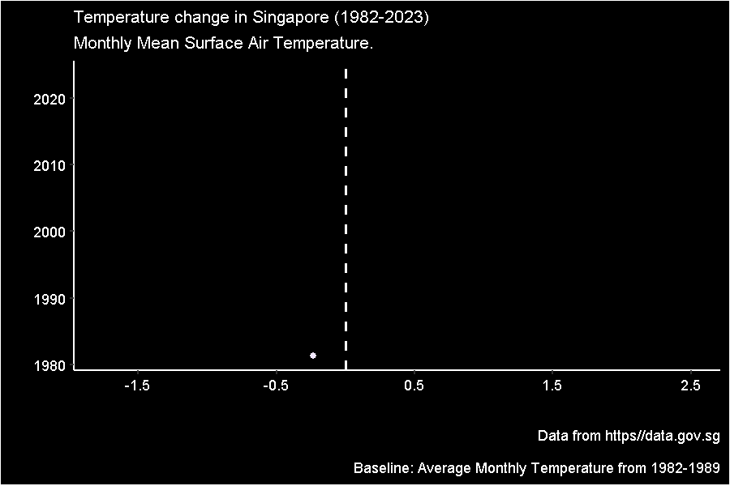

I stumbled upon Pat Schloss' youtube [channel](https://www.youtube.com/@Riffomonas) the other day, while searching for R tutorials online. I watched his video on creating an animated climate spiral, and was inspired to try and do the same, using data for Singapore.

This is the link to Pat's [blog](https://riffomonas.org/code_club/2022-06-02-climate-spiral). I "borrowed" his idea of using "next_jan" so that the lines for December and January would touch and appear seamless. Thanks Pat!

Here is my attempt at creating a temperature spiral for Singapore. It is slightly different from Pat's. My temperature lines are colored by temperature difference, rather than by year.

<center>


</center>

This is a different way of visualizing the same data. Which is more effective? Which do you prefer?

<center>



</center>

I didnt stop there. Since there was rainfall data available, I created something similar for rainfall in Singapore.

<center>


</center>

The code for generating the temperature spiral. WARNING! It takes while to render, which is why I've included them as animated gifs in this page, rather than having the code render them "on the fly". Data was obtained from [data.gov.sg](https://beta.data.gov.sg/). Wouldn't it be great to have data going back to the early 1900s?

You may use or modify the code for your own animation, but I would greatly appreciate a link back, please.

```{r, eval = FALSE, echo = TRUE}
# Remove all objects in workspace ----
rm(list = ls())

pacman::p_load(tidyverse, lubridate, glue, ggthemes, readr, gganimate, gifski, magick)

df <- read_csv("SurfaceAirTemperatureMonthlyMean.csv") #obtain data from data.gov.sg

data <-
  df %>% 
  separate_wider_delim(month,
                       delim = "-",
                       names = c("year", "mth")
                       ) %>% 
  as.tibble() %>% 
  mutate(year = as.numeric(year),
         mth = as.numeric(mth),
         month = month.abb[mth]
         )

df_8289 <- 
  data %>% 
  filter(year >= 1982 & year <= 1989) %>% 
  group_by(mth) %>% 
  summarise(m_temp = mean(mean_temp))

data_joined <-
  left_join(data, df_8289, by = "mth") %>% 
  mutate(temp_dev = round((mean_temp - m_temp), digits = 2))
  
next_jan <-
  data_joined %>% 
  filter(month == "Jan") %>% 
  mutate(year = year -1,
         month = "next_jan")

temp_data <-
  bind_rows(data_joined, next_jan) %>% 
  mutate(month = factor(month,
                        levels = c(month.abb, "next_jan")
                        ),
         mth = as.numeric(month)
         ) 

p <- 
  ggplot(data = temp_data,
       aes(x = mth,
           y = temp_dev,
           group = year)
       ) +
  geom_line(aes(color = temp_dev) #plot lines for each year
            )+
  geom_hline(yintercept = c(-1:2), # concentric lines indicating scale
             color = "grey")+
  geom_label(aes(x = 12, # year in the middle
                y = -2.8,
                label = year), 
            fill = "black",
            color = "white",
            size = 9,
            label.size = 0) +
  geom_label(aes(x = 12, #labels for each concentric line
                 y = -1),
             label = "-1 \u00B0C",
             fill = "black",
             color = "blue",
             label.size = 0,
             size = 5) +
  
  geom_label(aes(x = 12,
                 y = 0),
             label = "+0 \u00B0C",
             fill = "black",
             color = "yellow",
             label.size = 0,
             size = 5) +
  
  geom_label(aes(x = 12,
                 y = 1),
             label = "+1 \u00B0C",
             fill = "black",
             color = "orange",
             label.size = 0,
             size = 5) +
  geom_label(aes(x = 12,
                 y = 2),
             label = "+2 \u00B0C",
             fill = "black",
             color = "red",
             label.size = 0,
             size = 5) +

  coord_polar(start = 2*pi/12)+
  scale_x_continuous(breaks = 1:12,
                     labels = month.abb
                     ) +
  scale_y_continuous(breaks = seq(-1.5, 2.5, 0.2),
                     limits = c(-3, 2.5)
                     )+
  scale_color_gradient(low = "blue",
                       high = "red")+
  labs(title = "Temperature change in Singapore (1982-2023)",
       subtitle = "Monthly Mean Surface Air Temperature.",
       caption = "Data from https//data.gov.sg\n
       Baseline: Average Monthly Temperature from 1982-1989")+
  theme(legend.position = "none",
        plot.title = element_text(color = "white", 
                                  size = rel(1.2)),
        plot.subtitle = element_text(color = "white",
                                    size = rel(1)),
        plot.caption = element_text(color = "white",
                                    size = rel(0.8)),
        axis.text.x = element_text(color = "white",
                                   size = rel(2)),
        axis.text.y = element_blank(),
        axis.ticks = element_blank(),
        panel.background = element_rect(fill = "black"),
        panel.grid = element_blank(),
        plot.background = element_rect(fill = "black")
        ) +
  transition_time(year)+
  shadow_mark(past = TRUE, alpha = 0.9)
animate(p, fps = 10, nframes = 200, end_pause = 60)
anim_save("name_of_your_choice", p)

```
